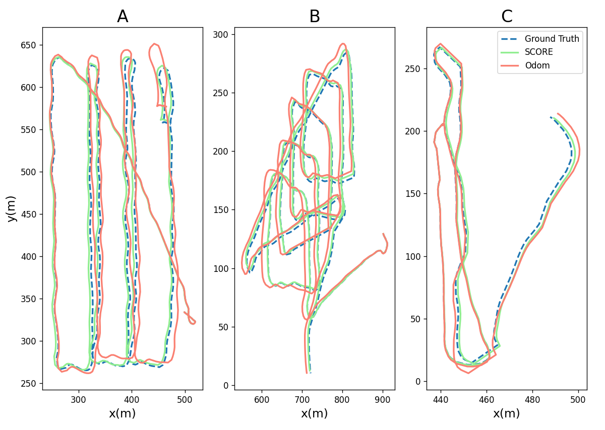
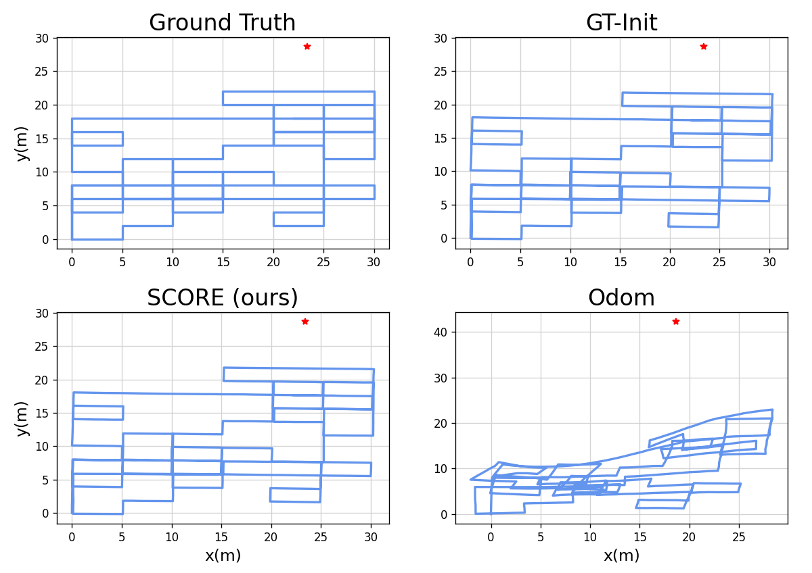

# SCORE: Second Order Conic Initialization for RA-SLAM

Code to solve a second-order cone program to initialize a local-search solver
for the range-aided SLAM problem. The SOCP is a convex relaxation of the
original problem.

Check out the extended version of our [paper](https://arxiv.org/abs/2210.03177)

## Results

We show the key results from our paper, comparing SCORE to a range of other initialization strategies.

### Real-World AUV Experiments

- SCORE: our method, using a second-order cone program for initialization
- Odom: initializing with robot odometry

### Simulated Single-Robot Experiments

- SCORE: our method, using a second-order cone program for initialization
- SCORE Init: the estimate returned by SCORE (before refining via local-search)
- Odom-R: initializing with robot odometry, randomizing the first pose of each robot
- Odom-P: initializing with robot odometry, initializing with the true first pose for each robot
- GT-Init: initializing with the ground-truth values (when available)

### Simulated Single-Robot Experiments

- SCORE: our method, using a second-order cone program for initialization
- Odom: initializing with robot odometry
- GT-Init: initializing with the ground-truth values (when available)

## Usage

Feel free to look inside our `/examples` directory. You can also directly call `python3 score/solve_score.py`
to run this on your own data.

## Dependencies

### PyFactorGraph

[Link to the repo](https://github.com/MarineRoboticsGroup/PyFactorGraph)

This holds all of the measurements/variables to define our RA-SLAM problem.
This is a custom library developed in the Marine Robotics Group at MIT to
interface with a broader range of SLAM file types (e.g. g2o). You can install
directly from source via `pip install .` inside the root of this repo.

### Drake Dependency (read carefully)

Drake is a wonderful piece of software... once it's installed. Installing the
python bindings for Drake can be a hassle. We will have to build Drake from
source to use the `Gurobi` solver, which is the real reason we are using Drake
(it gives us a great interface to the solver). Make sure that you have Gurobi
properly set up before doing any of this.

Useful links

- <https://drake.mit.edu/from_source.html#mandatory-platform-specific-instructions>
- <https://drake.mit.edu/bazel.html#proprietary-solvers>
- <https://drake.mit.edu/pydrake/pydrake.solvers.gurobi.html>

### evo (optional)

We use [evo](https://github.com/MichaelGrupp/evo) to perform visualization of our results and highly recommend it.

### GTSAM (optional)

We used GTSAM to refine our initial estimates provided by SCORE. We recommend
installing via `pip install gtsam==4.1.0`.
